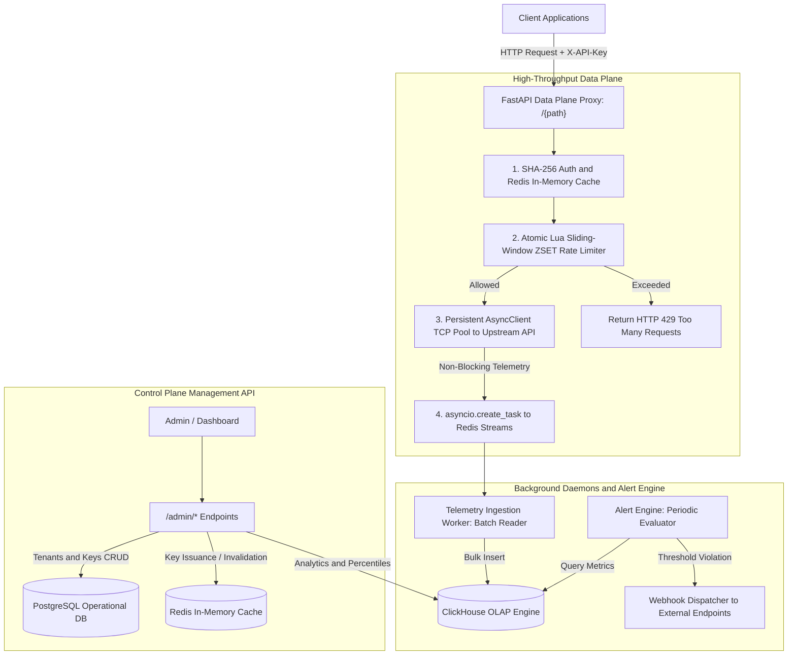

# Enterprise API Management Gateway & Observability SaaS Platform

A production-grade, high-throughput API Management Gateway and Real-Time Observability SaaS platform. Built with **FastAPI**, **Redis 7**, **PostgreSQL 15**, and **ClickHouse OLAP**, this system enforces sub-millisecond sliding-window rate limits, proxies traffic with under 5ms overhead, streams asynchronous telemetry logs, and provides high-cardinality performance analytics.

---

## 🏗️ 1. Architecture Overview & System Topology

The platform enforces a strict separation of concerns between the **Data Plane** (high-performance reverse proxy) and the **Control Plane** (tenant, key, and metrics administration).



### Key Architectural Pillars:
1. **Zero PostgreSQL Queries on Hot Path**: Active API keys and tenant upstream configurations are cached in Redis. Reverse proxy requests validate keys against Redis in sub-milliseconds without touching the database.
2. **Atomic Redis Lua Sliding-Window Rate Limiter**: Evaluates request moving windows in real-time across Sorted Sets (`ZSET`) with atomic script execution.
3. **Fire-and-Forget Asynchronous Telemetry**: Telemetry events are dispatched to Redis Streams via `asyncio.create_task`, ensuring zero latency overhead on client responses.
4. **ClickHouse OLAP Ingestion & Analytics**: A decoupled background worker consumes stream batches and flushes them into ClickHouse for computing high-cardinality aggregations ($P_{50}, P_{95}, P_{99}$ latencies, error rates, payload bandwidth).
5. **Real-Time Threshold Alerting**: An autonomous background daemon continuously tests ClickHouse metrics against defined tenant rules and dispatches webhook alerts.

---

## 📋 2. Prerequisites

- **Python**: 3.10, 3.11, 3.12, or 3.13
- **Docker & Docker Compose**: v24.0+ (for containerized stack)
- **Git**

---

## ⚙️ 3. Environment Variables Reference

Create a `.env` file from `.env.example`:

```bash
cp .env.example .env
```

| Variable | Default Value | Description |
| :--- | :--- | :--- |
| `PORT` | `8000` | Server listening port |
| `HOST` | `0.0.0.0` | Server host bind address |
| `ENVIRONMENT` | `development` | `development` or `production` |
| `DATABASE_URL` | `sqlite+aiosqlite:///./apigateway.db` | Async SQLAlchemy DB URI (e.g. `postgresql+asyncpg://...`) |
| `REDIS_URL` | `redis://localhost:6379/0` | Redis 7 connection URI |
| `CLICKHOUSE_HOST` | `localhost` | ClickHouse host address |
| `CLICKHOUSE_PORT` | `8123` | ClickHouse HTTP interface port |
| `CLICKHOUSE_DB` | `default` | ClickHouse database name |
| `PROXY_TIMEOUT_SECONDS`| `30.0` | Timeout for proxied upstream HTTP requests |
| `MAX_KEEPALIVE_CONNECTIONS` | `100` | Persistent connection pool size |
| `MAX_CONNECTIONS` | `500` | Max concurrent HTTP connections |
| `ALERT_EVAL_INTERVAL_SECONDS` | `30` | Interval for background alert evaluation |

---

## 🚀 4. Local Setup Guide

### Option A: Quickstart with Docker Compose (Full Stack)

Launches **FastAPI**, **Redis 7**, **PostgreSQL 15**, **ClickHouse Server**, **Telemetry Worker**, and **Alert Worker** in a single command:

```bash
docker-compose up -d
```

Check service status:
```bash
docker-compose ps
```

### Option B: Local Python Development Setup

1. **Install dependencies**:
   ```bash
   pip install -r requirements.txt
   ```

2. **Run test suite**:
   ```bash
   python -m pytest backend/app/tests -v
   ```

3. **Start the API Server (with embedded background workers)**:
   ```bash
   python backend/run_server.py
   ```

- **Interactive Swagger Docs**: [http://localhost:8000/docs](http://localhost:8000/docs)
- **ReDoc Documentation**: [http://localhost:8000/redoc](http://localhost:8000/redoc)

---

## 🧪 5. API Testing Walkthrough (Executable `curl` Commands)

### Step 1: Register a Tenant (Control Plane)
```bash
curl -X POST http://localhost:8000/admin/tenants \
  -H "Content-Type: application/json" \
  -d '{
    "name": "Stripe Payments Inc",
    "slug": "stripe-payments",
    "upstream_url": "https://httpbin.org",
    "plan_tier": "pro",
    "rate_limit_rpm": 60,
    "burst_limit": 10
  }'
```
*Response returns tenant `id` (e.g. `3a6e9a0c-...`).*

---

### Step 2: Issue an API Key (Control Plane)
```bash
curl -X POST http://localhost:8000/admin/keys \
  -H "Content-Type: application/json" \
  -d '{
    "tenant_id": "<TENANT_ID>",
    "name": "Production Key"
  }'
```
*Response returns the raw plaintext key **once** (e.g. `ak_live_xYz123...`). The database stores only the SHA-256 hash digest, and Redis cache is populated immediately.*

---

### Step 3: Execute Proxied Requests (Data Plane)
Capture and forward all HTTP methods, headers, and query parameters to the tenant's designated upstream target:

```bash
curl -X GET "http://localhost:8000/get?param1=value1" \
  -H "X-API-Key: <RAW_API_KEY>" \
  -i
```

**Response Headers Include**:
```http
HTTP/1.1 200 OK
X-RateLimit-Limit: 60
X-RateLimit-Remaining: 59
X-Gateway-Latency-Ms: 12.45
```

---

### Step 4: Test Sliding-Window Rate Limit Enforcement (HTTP 429)
When requests exceed the configured moving window:

```bash
# Sending requests in rapid succession
for i in {1..70}; do
  curl -s -o /dev/null -w "%{http_code}\n" -H "X-API-Key: <RAW_API_KEY>" http://localhost:8000/get
done
```

**Response**:
```http
HTTP/1.1 429 Too Many Requests
X-RateLimit-Limit: 60
X-RateLimit-Remaining: 0
Retry-After: 42

{
  "error": "Too Many Requests",
  "detail": "Rate limit of 60 req/min exceeded. Retry after 42s.",
  "retry_after_seconds": 42
}
```

---

### Step 5: Real-Time Telemetry & High-Cardinality Metrics (OLAP)
Query ClickHouse for aggregations, $P_{50}, P_{95}, P_{99}$ latencies, error rates, and payload bandwidth:

```bash
curl -X GET "http://localhost:8000/admin/metrics?time_window_seconds=3600"
```

**Sample Response**:
```json
{
  "total_requests": 1542,
  "error_count": 8,
  "error_rate_pct": 0.52,
  "status_breakdown": {
    "2xx": 1534,
    "4xx": 6,
    "5xx": 2
  },
  "latency_percentiles_ms": {
    "p50": 8.42,
    "p95": 24.15,
    "p99": 65.80,
    "avg": 11.20,
    "min": 2.10,
    "max": 142.50
  },
  "bandwidth_bytes": {
    "request_bytes": 1420500,
    "response_bytes": 8420100,
    "total_bytes": 9840600
  },
  "routes_breakdown": [
    {
      "route": "/get",
      "method": "GET",
      "count": 1200,
      "avg_latency": 7.8,
      "p95_latency": 18.2,
      "error_rate": 0.1
    }
  ],
  "time_window_seconds": 3600
}
```

---

### Step 6: Create and Test Automated Alert Rules
Register an automated rule monitoring $P_{95}$ latency or error rate spikes:

```bash
curl -X POST http://localhost:8000/admin/alerts \
  -H "Content-Type: application/json" \
  -d '{
    "tenant_id": "<TENANT_ID>",
    "name": "Latency Breach Alert",
    "metric_type": "p95_latency",
    "threshold": 500.0,
    "window_minutes": 5,
    "webhook_url": "https://webhook.site/<YOUR_UUID>"
  }'
```

Test dispatching a sample webhook payload:
```bash
curl -X POST http://localhost:8000/admin/alerts/<ALERT_RULE_ID>/test
```

---

### Step 7: Revoke API Key (Instant Cache Invalidation)
Revoking a key deletes it from PostgreSQL and actively purges the Redis cache:

```bash
curl -X DELETE http://localhost:8000/admin/keys/<KEY_ID>
```

Subsequent requests using this key immediately fail:
```bash
curl -X GET http://localhost:8000/get -H "X-API-Key: <REVOKED_KEY>"
# HTTP 401 Unauthorized -> {"error": "Unauthorized", "detail": "Invalid, inactive, or revoked API key."}
```

---

## 🏛️ 6. Data Architecture Standards

- **PostgreSQL**: Manages relational metadata (tenants, key hashes, alert configurations).
- **Redis 7**: High-speed metadata caching, sliding-window rate limit state via atomic Lua ZSETs, and short-term stream buffering.
- **ClickHouse**: Dedicated OLAP column-oriented data store for high-cardinality telemetry event logs.
- **Strict Separation**: Gateway proxy logs are **never** flushed into PostgreSQL to protect operational metadata throughput.
